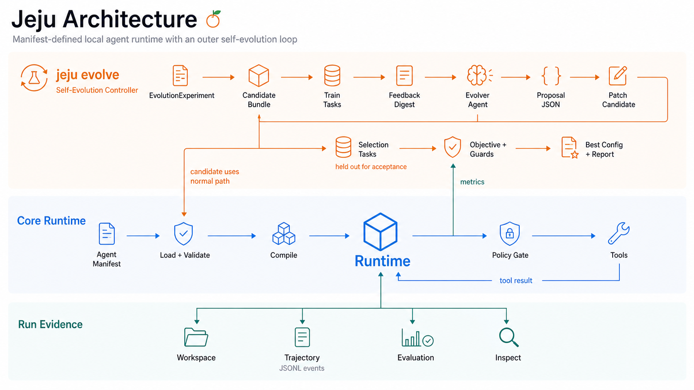
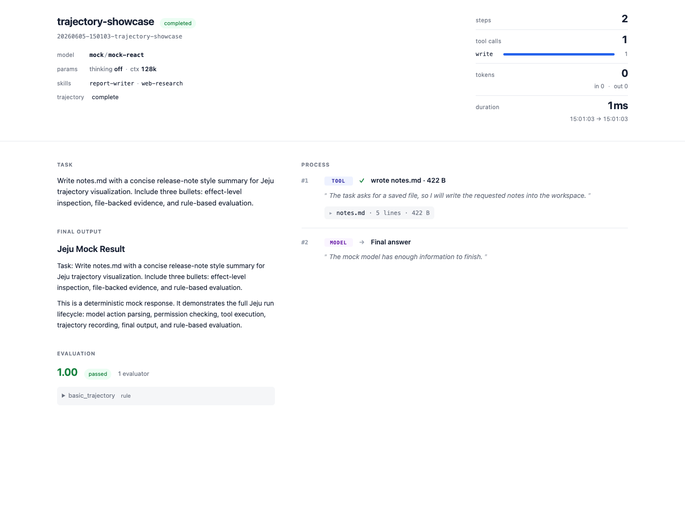

# Jeju

> Local-first agent harness: define behavior in config, run with boundaries,
> inspect every effect, and improve with evaluation evidence.



## What Is Jeju?

Jeju is an experimental local-first agent harness for developers who want agent
behavior to be explicit, bounded, inspectable, and evaluable.

A Jeju agent is defined by a manifest: model provider, instructions, runtime
loop, workspace, tools, skills, permissions, context budget, and evaluators.
Jeju validates and compiles that manifest, runs the agent against a local
workspace, records every meaningful effect in `trajectory.jsonl`, and can use
evaluation evidence to improve the agent with `jeju evolve`.

Jeju is not a broad multi-agent platform. It is strongest when a local workflow
can be packaged as a focused agent with clear tools, permissions, run evidence,
and optional evaluation.

## Quick Start

Run the showcase bug rescue agent to see Jeju repair a small local project,
rerun tests, write a repair note, and record the full trajectory. It uses
DeepSeek V4 Flash and does not require external search services.

```bash
# Install the latest released CLI on macOS or Linux.
curl -fsSL https://raw.githubusercontent.com/cosmtrek/jeju/master/scripts/install.sh | sh
jeju version

# Run the DeepSeek V4 Flash showcase.
export DEEPSEEK_API_KEY=sk-...
git clone https://github.com/cosmtrek/jeju.git
cd jeju
./scripts/run-bug-rescue-agent.sh

# Inspect the recorded run printed by the script.
jeju inspect --runs-dir .jeju-dev/runs/bug-rescue <run_id>
jeju view --runs-dir .jeju-dev/runs/bug-rescue <run_id>
```

The run writes:

```text
.jeju-dev/runs/bug-rescue/<run_id>/
  trajectory.jsonl     # canonical append-only run record
  report.html          # derived inspection view
```

The script copies a broken ledger fixture into `.jeju-dev/workspaces/bug-rescue`
before each run, so the committed example stays unchanged. For a no-credential
mock lifecycle check, use `jeju init <name>` or `make test-agent`.

Jeju currently supports macOS and Linux. Windows is not guaranteed yet. Source
installs require Go 1.25 or newer:

```bash
go install github.com/cosmtrek/jeju/cmd/jeju@latest
```

Some example evaluators use Python 3.

## Get Started

We provide a `jeju-agent-builder` skill for Codex, Claude Code, and other agent
environments. Install the skill in your agent environment when you want that
agent to create, modify, run, and inspect Jeju agents for you.

```bash
npx skills add cosmtrek/jeju --skill jeju-agent-builder
```

Then ask your agent:

```text
Use jeju-agent-builder to create and smoke-test a minimal Jeju agent for <workflow>.
```

You can also build manually with `jeju init <name> --dir ~/jeju-agents/<name>`,
then edit the manifest and prompt, run `jeju validate`, run a smoke task, and
inspect the trajectory with `jeju inspect` or `jeju view`.

See [Manual For Agents](docs/manual-for-agents.md) for the self-contained
authoring guide and [Agent Manifest](docs/agent-manifest.md) for the full field
reference.

## Inspect A Run

Every run is inspectable. `trajectory.jsonl` is the source of truth; the HTML
report is a projection generated by `jeju run` or `jeju view`.



Use `jeju inspect` for a terminal summary and `jeju view` to open the report:

```bash
jeju inspect <run_id>
jeju view <run_id>
```

The report shows agent identity, model, loaded skills, task, final output,
process steps, tool calls, artifacts, token and duration summaries, and
evaluation results. `jeju view` opens the existing report when it is fresh, and
regenerates it first when the report is missing or older than `trajectory.jsonl`.

See [Trajectory Visualization](docs/trajectory-visualization.md) and
[Trajectory Format](docs/trajectory-format.md) for details.

## Key Capabilities

- **Config-defined behavior**: define models, instructions, tools, skills,
  permissions, context budget, and evaluation in one manifest.
- **Strict execution boundaries**: constrain work inside explicit workspace,
  tool, skill, permission, sandbox, timeout, and context-window limits.
- **Effect-level inspection**: record lifecycle, model, context, tool,
  permission, artifact, evaluation, and run summary events.
- **File-backed evidence**: keep one canonical append-only `trajectory.jsonl`
  plus a derived `report.html` view for review.
- **Evaluation-guided improvement**: run task sets, score outcomes, and use
  `jeju evolve` to search bounded config-space patches.
- **Portable agent bundles**: package focused workflows so developers or
  higher-level AI agents can reuse them in local workspaces.

## Use Cases

- **Agent experiments**: prototype local agents by changing manifest fields,
  prompts, skills, tools, model providers, and runtime limits.
- **Evaluation harnesses**: run a fixed agent against task cases and compare
  outcomes with rule, command, or LLM evaluators.
- **Reusable specialist agents**: package review, triage, research, docs, or
  benchmark workflows into portable bundles.
- **High-frequency workflow capture**: turn repeated local tasks into bounded
  agents that can be run by a developer or invoked by a higher-level AI agent.

Prefer a script for deterministic automation. Prefer an authoring-agent skill
when the value is only reusable instructions or prompt guidance. Use Jeju when
the workflow needs model reasoning plus explicit tools, permissions, run
evidence, or evaluation.

## Agent Bundle Shape

A Jeju agent bundle is a portable directory that keeps runtime behavior,
instructions, optional skills, and optional evaluation close together. A minimal
bundle is just enough structure to validate and run:

```text
agents/<name>.agent.yaml
prompts/<name>.md
workspace/<name>/.gitkeep
skills/<optional-runtime-skill>/SKILL.md
eval/<optional-evaluator>.py
README.md
```

Keep the manifest as the source of truth. Put durable behavior in manifest
fields, prompt files, runtime skills, tools, permissions, limits, and evaluator
config rather than hardcoding runtime branches.

## How It Works

Jeju treats an agent as a small, explicit harness unit instead of an opaque
application:

```text
Manifest -> Validate -> Compile -> Run -> Gate -> Trace -> Evaluate -> Inspect
```

The runtime does not read YAML directly. Configuration is loaded, validated,
and compiled into a `CompiledAgent` before execution. Runtime behavior comes
from the manifest, loaded instructions, tools, skills, permissions, context
budget, and evaluator configuration.

At a high level, a read-only specialist manifest looks like this:

```yaml
apiVersion: jeju/v1alpha1
kind: Agent

metadata:
  name: repo-inspector
  description: "Inspect a local repository and produce a structured summary"

models:
  providers:
    primary:
      type: openaiCompatible
      preset: deepseek
      model: deepseek-v4-flash
      envKey: DEEPSEEK_API_KEY

instructions:
  system: ../prompts/repo-inspector.md

runtime:
  model: primary
  loop:
    type: react
  limits:
    maxSteps: 12
    maxDurationSec: 300

workspace:
  path: ../workspace/repo-inspector

tools:
  - read
  - search

permissions:
  access: readOnly
  approval: never

evaluate:
  enabled: true
  evaluators:
    - name: basic
      uses: rules
      rules: [finalAnswerExists, runCompleted]
```

See [Agent Manifest](docs/agent-manifest.md) for the full field reference,
defaults, supported values, and validation rules.

## Evaluation-Guided Improvement

`jeju evolve` improves a config-defined agent without mutating the source agent
in place. An evolution experiment points at a target agent, datasets, an
objective metric, edit boundaries, an evolver agent, search limits, and an
output directory.

The loop is intentionally offline and auditable:

```text
baseline agent
  -> train and selection runs
  -> effective evaluation
  -> feedback digest
  -> evolver proposal
  -> exact-replacement patch
  -> validate and compile candidate
  -> train filter
  -> selection acceptance
  -> best candidate bundle and report
```

Common commands:

```bash
jeju evolve --dry-run experiments/evolve.yaml
jeju evolve --baseline-only experiments/evolve.yaml
jeju evolve experiments/evolve.yaml
jeju evolve --test experiments/evolve.yaml
```

See [Evolution Manifest](docs/agent-evolution-manifest.md) and
[Self Evolution](docs/self-evolution.md) for the full schema and design notes.

## Examples

Runnable recommended scenarios live under [examples](examples/README.md). These
are example agent bundles, not test fixtures.

Current examples cover:

- [Bug rescue agent](examples/bug-rescue-agent/README.md)
- [Code review agent](examples/code-review-agent/README.md)
- [Commit plan agent](examples/commit-plan-agent/README.md)
- [Privacy delegation agent](examples/privacy-delegation-agent/README.md)
- [SkillsBench Lite agent](examples/skillsbench-lite-agent/README.md)

They show how Jeju defines behavior in config, runs with explicit boundaries,
records effects, and uses evaluation evidence to improve an agent.

## Documentation

- [Agent Manifest](docs/agent-manifest.md)
- [Trajectory Visualization](docs/trajectory-visualization.md)
- [Trajectory Format](docs/trajectory-format.md)
- [Evolution Manifest](docs/agent-evolution-manifest.md)
- [Self Evolution](docs/self-evolution.md)
- [Manual For Agents](docs/manual-for-agents.md)
- [DeepSeek Setup](docs/deepseek.md)

## Development

Run the normal code checks:

```bash
go test ./...
go vet ./...
```

Run the mock fixture agent end to end without credentials:

```bash
make test-agent
```

Provider-backed and heavier smoke runs are opt-in and may call real model APIs:

```bash
export DEEPSEEK_API_KEY=sk-...
make test-agent PROVIDER=deepseek

export MIMO_API_KEY=sk-...
make test-agent PROVIDER=mimo

make test-long-horizon-agent PROVIDER=mimo
make test-evolve-e2e PROVIDER=mock
make test-evolve-effect-e2e PROVIDER=mock
```

For source-checkout development, avoid writing generated runs to repo-root
`runs/` or example-local `runs/` directories. Prefer:

```bash
jeju run --runs-dir .jeju-dev/runs/<scenario> <agent.yaml> "<task>"
jeju inspect --runs-dir .jeju-dev/runs/<scenario> <run_id>
jeju view --runs-dir .jeju-dev/runs/<scenario> <run_id>
```

Inside a generated user agent project, the default `./runs` store remains the
normal local run history.

## License

Jeju is released under the MIT License. See [LICENSE](LICENSE) for details.
