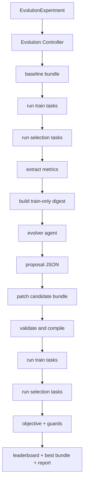

# Evaluation-Guided Improvement

Jeju agents are defined by configuration, prompts, tools, skills, permissions, and evaluators. A normal run already leaves an auditable record under `runs/<run_id>/`: the config snapshot, trajectory, final answer, evaluation result, and artifacts. Evaluation-guided improvement builds an optimization loop on top of that record.

The loop is:

```text
target agent -> train runs -> evaluator feedback -> evolver proposal -> patched candidate -> train/selection validation -> best config -> optional test holdout
```

The runtime contract stays the same. Every candidate still goes through:

```text
config.LoadFile -> config.Validate -> compiler.Compile -> runtime.Run
```

`jeju evolve` is an outer controller. It never asks the runtime to interpret experiment YAML, and it never writes changes back to the source agent files.

## Goals

- Improve a baseline agent manifest with `jeju evolve <experiment.yaml>`.
- Let the user define the optimization objective, guardrails, editable fields, datasets, budget, and output location.
- Treat system prompts and explicitly allowed harness files as editable, but
  only through controlled exact-replacement patches inside isolated candidate
  bundles.
- Validate candidates with train and selection splits before accepting a new best config.
- Optionally run `data.test` after selection on baseline and final best with `--test`.
- Keep all evidence on disk: proposals, patches, run outputs, metrics, leaderboard, report, and event log.

## Non-Goals

- No automatic production rollout. Evolution outputs candidates and evidence only.
- No unrestricted schema or tool mutation. Credentials, workspace paths, tool command bodies, HTTP endpoints, and permissions are protected by default.
- No reinforcement learning or model fine-tuning. The current implementation is black-box config search.
- No replacement for the evaluator system. Evolution reuses rule, LLM, and command evaluators plus task-level expectations.

## Core Concepts

| Concept | Meaning |
| --- | --- |
| Target agent | The baseline `kind: Agent` manifest to optimize. |
| EvolutionExperiment | The experiment manifest consumed by `jeju evolve`. |
| Candidate | A materialized copy of the target agent bundle. `baseline` is the first candidate. |
| Task | One JSONL dataset row with `input`, optional `expected`, optional `eval`, metadata, and weight. |
| Trial | One run of one candidate on one task. |
| Objective | The metric to optimize, optional direction, minimum improvement, guards, and qualitative guidance. |
| Evolver | A normal Jeju agent that reads a feedback digest and returns structured proposals. |
| Proposal | Structured JSON with a hypothesis and exact text replacements. |
| Selection | The acceptance step that chooses whether a candidate becomes the new best config. |

The manifest reference for experiments lives in [agent-evolution-manifest.md](agent-evolution-manifest.md).

## Evolution Flow



The first phase runs the baseline on train and selection. All `baseline.<metric>` values are interpreted within the current split, so train guards compare against train baseline metrics and selection guards compare against selection baseline metrics.

Each iteration then:

1. Builds a deterministic feedback digest from the current best candidate's train results and the accepted/rejected proposal history.
2. Runs the evolver agent with that digest.
3. Parses only structured proposal JSON from the evolver final answer.
4. Materializes candidate bundles by applying exact text replacements.
5. Validates that only editable manifest fields changed and no forbidden fields changed.
6. Compiles the candidate agent.
7. Runs train as a coarse filter, then selection as the acceptance gate.
8. Accepts the candidate only if the objective improves by `minDelta` and all guards pass.

Selection task details are intentionally withheld from the evolver digest. Selection is for validation, not prompt feedback.

## Datasets

Evolution uses three logical splits:

- `train`: visible feedback for the evolver. Failures and metrics from this split drive proposals.
- `selection`: held-out validation used to accept or reject candidates.
- `test`: optional final holdout split. It runs only when `jeju evolve --test` is specified, after candidate selection, on baseline and the final best.

Task rows use `jeju.task.v1` JSONL. The fixed fields are small and the user owns the payload shape:

```json
{
  "id": "triage-001",
  "input": {
    "ticket": "Card checkout failures increased after a PSP routing change.",
    "customer_tier": "enterprise"
  },
  "expected": {
    "fields": {
      "severity": "P1",
      "route": "payments",
      "action": "rollback"
    }
  },
  "eval": {
    "rubric": "Return strict JSON and choose the right route/action."
  },
  "metadata": {
    "category": "payments"
  },
  "weight": 1
}
```

`data.render.template` is a Go template over the task object. The rendered string becomes the `runtime.Run` input. `expected`, `eval`, and `metadata` are passed to evaluators but are not part of the rendered task unless the template includes them.

Task-level `expected` and `eval` take precedence over the target agent's default evaluator behavior. The controller writes an effective `evaluation.json` for each trial after the run completes.

## Objective and Selection

The objective has one primary metric:

```yaml
objective:
  metric: evaluation.evaluators["triage_judge"].score
  minDelta: 0.2
  guards:
    - "evaluation.passed_rate >= baseline.evaluation.passed_rate"
    - "run.modelErrors <= baseline.run.modelErrors"
  guidance:
    - "Improve general triage behavior rather than memorizing examples."
```

Supported metric sources include:

- `evaluation.score`
- `evaluation.passed_rate`
- `evaluation.evaluators["name"].score`
- `evaluation.evaluators["name"].passed`
- `evaluation.evaluators["name"].rules["rule"].passed`
- `run.steps`
- `run.toolCalls`
- `run.modelCalls`
- `run.modelErrors`
- `run.toolErrors`
- `run.permissionDenied`
- `run.tokens` or `run.totalTokens`
- `run.promptTokens`
- `run.completionTokens`
- `run.durationSec`

Metrics are weighted by task `weight` and averaged over tasks and trials.

Guards are hard constraints. A candidate can improve the primary metric and still be rejected if any guard fails. Guard expressions support metric names, `baseline.` metric names, numbers, arithmetic, parentheses, and comparison operators.

## Patch Model

The current patch model is deliberately simple:

```json
{
  "id": "proposal-001",
  "hypothesis": "The agent fails because it does not request strict JSON.",
  "changes": [
    {
      "target": "instructions.system",
      "find": "You are a support triage assistant.\n",
      "replace": "You are a support triage assistant. Return only strict JSON.\n"
    }
  ]
}
```

Rules:

- `target` must match `target.editable`.
- `target` must not match effective `target.forbidden`. Jeju applies default
  forbidden paths for permissions, workspace, credentials, tool execution
  wiring, evaluator commands, and skill directory bindings; manifest
  `target.forbidden` is only for extra case-specific constraints.
- Default patches use `op: "replace"`; `find` must match exactly once in the
  candidate bundle.
- `op: "write"` writes `content` to an editable `file:` target or to
  `instructions.system`. This can create files inside an editable directory.
- `instructions.system` patches edit the referenced prompt file, not the manifest scalar.
- `harness:prompt` in `target.editable` expands to `instructions.system`.
- `skill:<name>` expands to `skills.active` plus the named skill directory
  under configured `skills.dirs` roots.
- `harness:skills` expands to `skills.active` plus all configured
  `skills.dirs` roots.
- `tool:<name>` expands to the named tool's description. This is the default
  safe surface for tool-use strategy.
- `harness:tools` expands the same tool-use strategy surface for every tool.
- `file:<relative-path>` patches edit a candidate-bundle file resolved relative
  to the target agent manifest, for example
  `file:../skills/research/SKILL.md`.
- `dir:<relative-path>` exposes files under a candidate-bundle directory and
  authorizes `file:` patches inside it.
- Other targets edit the candidate manifest text directly.
- Tool schema files, implementation files, command paths, HTTP URLs,
  environment, and capabilities are not included in `tool:<name>`; list those
  fields explicitly if the experiment needs to mutate parameter contracts or
  execution boundaries.
- After patching, Jeju snapshots manifest leaf fields and rejects any changed field outside the editable set or inside the forbidden set.
- The patched candidate must pass agent validation and compilation before it can run.

Path patterns support array wildcard `[]` and map wildcard `*`, for example `tools[].description` and `models.providers.*.temperature`.

## Evolver Agent

The evolver is itself a normal Jeju agent. It should usually have a read-only or isolated workspace, but the controller ignores any file writes from the evolver. The only patch source is the structured JSON proposal in the evolver final answer.

The feedback digest contains:

- objective and guard configuration
- editable and forbidden paths
- current best candidate id
- current best train results
- proposal history and rejection reasons
- editable content, including the manifest, `instructions.system`, and any
  editable `file:` targets
- qualitative guidance

It intentionally does not include selection task details. This keeps selection useful as a validation gate and reduces overfitting.

## Output Layout

Each experiment creates:

```text
.jeju-dev/evolve/<name>/<experiment_id>/
  experiment.snapshot.json
  events.jsonl
  baseline/
    agents/...
    prompts/...
    tasks/<task_id>/trial-01/runs/<run_id>/
    results.json
  iterations/001/
    feedback_digest.json
    evolver/runs/<run_id>/
    proposals.json
    candidate-001-01/
      patch.json
      results.json
      tasks/...
  best/
    agents/...
    prompts/...
    results.json
  leaderboard.json
  report.md
```

In a generated user agent project, `.jeju-dev/evolve/<name>` can be relative to
that project. In the Jeju source checkout, write evolution output to repo-root
`.jeju-dev/evolve/<scenario>` rather than example-local `.jeju-dev/` directories.

`best/` is a copy of the accepted best candidate bundle. It is the config artifact a human can inspect, compare, and choose to promote manually.

## CLI

```bash
jeju evolve experiments/research-evolve.yaml
jeju evolve --baseline-only experiments/research-evolve.yaml
jeju evolve --dry-run experiments/research-evolve.yaml
jeju evolve --max-iterations 2 --out .jeju-dev/evolve/research experiments/research-evolve.yaml
```

`--baseline-only` runs train and selection for the baseline and writes a report without calling the evolver. `--dry-run` validates the experiment and compiles the baseline bundle without model calls. `--test` runs `data.test` after selection on baseline and final best, and records test metrics without using them for candidate acceptance.

## Validation Fixtures

Mechanics fixture:

```bash
./scripts/run-evolve-e2e.sh mock
export MIMO_API_KEY=...
./scripts/run-evolve-e2e.sh mimo
```

Effect fixture:

```bash
./scripts/run-evolve-effect-e2e.sh mock
export MIMO_API_KEY=...
./scripts/run-evolve-effect-e2e.sh mimo
```

The effect fixture uses unseen holdout audit tasks outside the evolution selection loop. A successful real Mimo run should show baseline test score near zero and a much higher best-candidate test score.

## Current Implementation Notes

- Core train/selection evolution is implemented.
- Task-level expected/eval context is passed to effective evaluation.
- Non-interactive evolution currently auto-approves runtime permission prompts and auto-answers `ask_user` with an empty string. Hard policy denials still block execution. This is intentionally simple and should be tightened before production automation.
- `data.test` runs only when `--test` is specified, and only after candidate selection.
- The proposal channel accepts structured JSON from the evolver final answer. Empty or structurally invalid proposals are rejected before candidate evaluation.

## Future Directions

The most useful extensions are harness-oriented, not just prompt-oriented:

- Richer test reporting: include baseline-vs-best deltas and per-task failure summaries for `data.test`.
- Resume support: continue a previous experiment directory without rerunning completed trials.
- Stronger proposal schema: enforce JSON Schema response formats for evolver outputs when the provider supports it.
- Failure-surface tagging: classify failures as prompt, tool, skill, evaluator, data, or harness issues before proposing edits.
- Rejected-edit buffer: keep rejected proposals in the digest so the evolver avoids repeating invalid or harmful edits.
- Skill evolution: allow tightly scoped edits to active skill instructions after prompt-only evolution is reliable.
- Cost-aware search: add internal retry, beam, or successive-halving strategies without expanding the public manifest surface too early.
